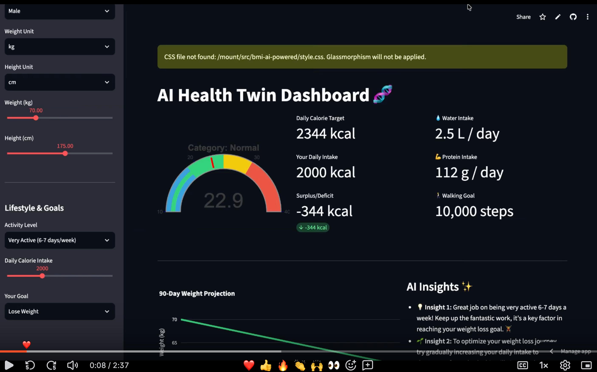
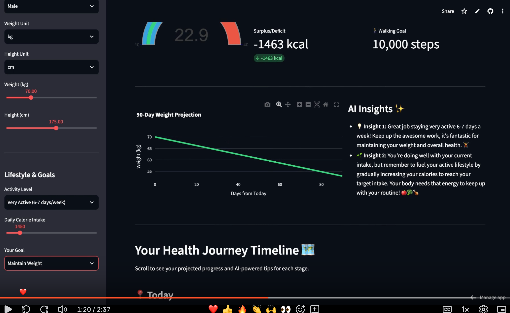
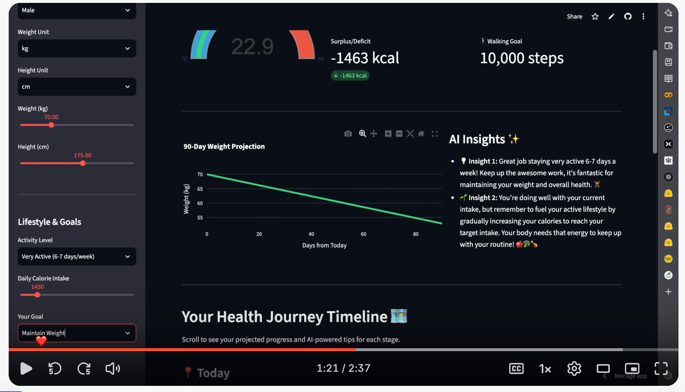

<div align="center">


<br/>


&nbsp;

&nbsp;


<br/><br/>

> _A dashboard that doesn't just show your health data — it understands it._

<br/>

**[🎥 Watch Demo](#demo) · [🚀 Live App](#live) · [✨ Features](#features) · [🛠️ Setup](#setup)**

</div>

---

## What is AI Health Twin?

Most health apps show you numbers. AI Health Twin tells you what those numbers mean, where they're going, and what to do next.

Enter your age, weight, height, and activity level once. The dashboard generates your complete metabolic profile — calorie targets, protein intake, hydration goals, 90-day weight projection — and pairs it with an AI coach that gives you contextual, personalized guidance at every milestone.

It's not a tracker. It's a twin.

---

## Demo

<div align="center">

<!-- GitHub doesn't render iframes — this is the standard workaround:        -->
<!-- a linked thumbnail that opens your Loom video on click.                  -->
<!-- TO SET UP: Go to your Loom video → Share → "Copy thumbnail image URL"   -->
<!-- Replace the src below with that thumbnail URL, OR screenshot your video  -->
<!-- and upload it to /screenshots/demo-thumbnail.png in this repo.           -->

[](https://www.loom.com/share/135928721e894dc7ab49458369f43e68)

▶ **[Click to watch the full demo on Loom](https://www.loom.com/share/135928721e894dc7ab49458369f43e68)**

</div>

> _See the BMI gauge, real-time metabolic calculations, AI Insights panel, and 90-day weight projection in action._

---

## Screenshots

<div align="center">

| Health Dashboard | Health Journey Timeline |
|---|---|
|  |  |
| BMI gauge · Calorie targets · AI Insights | 30/60/90-day projections · AI Coach |

</div>

---

## Features

### 🧬 Real-Time BMI Analysis
A live gauge dial that updates as you move the sliders. Category — Underweight, Normal, Overweight, Obese — displayed with color-coded zones. No page reload. No submit button.

### 🔥 Full Metabolic Profile
From a single set of inputs, the dashboard computes:

| Metric | What it tells you |
|---|---|
| **Daily Calorie Target** | Your TDEE based on activity level |
| **Daily Intake** | What you're actually consuming |
| **Surplus / Deficit** | The gap — positive or negative |
| **Protein Goal** | Grams per day for your body weight |
| **Water Intake** | Liters per day for your stats |
| **Walking Goal** | Daily step target |

### 📈 90-Day Weight Projection
A smooth projection curve showing exactly where your current habits take you over the next 3 months. Adjusts in real time as you change inputs — instant what-if modeling.

### 🗺️ Health Journey Timeline
Milestone cards for Today → 30 Days → 60 Days → 90 Days. Each stage shows:
- Projected weight and BMI
- Percentage progress toward your goal
- AI Coach message personalized to that exact moment in your journey

### ✨ AI Insights Panel
Context-aware coaching generated from your health profile. Not generic tips — observations tied to your specific numbers, activity level, and progress trajectory.

---

## How It Works

```
User Input                    AI Processing                  Output
─────────────────────────────────────────────────────────────────────
Age · Sex · Weight      →     TDEE Calculation          →   Calorie Target
Height · Activity             Harris-Benedict Equation       Protein Goal
Goal Weight                   BMI Classification             Water Intake

                        →     90-Day Projection Model   →   Weight Timeline
                              (deficit × days)               Milestone Cards

                        →     LLM Insight Generation    →   AI Coach Messages
                              (profile → prompt → AI)        Personalized Tips
```

---

## Tech Stack

| Layer | Technology |
|---|---|
| **Frontend** | React · TypeScript · Tailwind CSS |
| **Charts** | Recharts (BMI gauge + weight projection) |
| **AI Layer** | LLM integration for insight and coaching generation |
| **Health Formulas** | Harris-Benedict · Mifflin-St Jeor · BMI |
| **State** | React hooks, real-time slider updates |

---

## Setup

```bash
# Clone
git clone https://github.com/yourusername/ai-health-twin.git
cd ai-health-twin

# Install
npm install

# Add your AI API key
cp .env.example .env
# → VITE_AI_API_KEY=your_key_here

# Run
npm run dev
```

Open `http://localhost:5173` and enter your health profile.

---

## Input Parameters

| Parameter | Range | Notes |
|---|---|---|
| Age | 10 – 100 | Years |
| Sex | Male / Female | Affects BMR calculation |
| Weight | 30 – 200 kg | Or lbs — unit toggle included |
| Height | 100 – 250 cm | Or ft/in — unit toggle included |
| Activity Level | Sedentary → Very Active | 5 levels (PAL multipliers) |
| Goal Weight | Optional | Drives 90-day projection |

---

## Health Formulas Used

**Basal Metabolic Rate (BMR)** — Mifflin-St Jeor:
```
Male:   BMR = (10 × weight_kg) + (6.25 × height_cm) − (5 × age) + 5
Female: BMR = (10 × weight_kg) + (6.25 × height_cm) − (5 × age) − 161
```

**Total Daily Energy Expenditure (TDEE)**:
```
TDEE = BMR × Activity Multiplier
(Sedentary: 1.2 → Very Active: 1.725)
```

**90-Day Projection**:
```
Daily Δ weight = (intake_kcal − TDEE) / 7700
Projected weight at day N = current_weight + (daily_Δ × N)
```

---

## Roadmap

- [ ] Meal logging with auto calorie calculation
- [ ] Wearable sync (Fitbit, Apple Health, Google Fit)
- [ ] Weekly progress reports with AI summary
- [ ] Nutrition breakdown (macros, micros)
- [ ] Sleep quality integration
- [ ] Export health report as PDF
- [ ] Mobile app (React Native)

---

## Built By

Built in public by someone who wanted a health dashboard that actually thinks.

- 💼 [LinkedIn](https://linkedin.com/in/yourusername) — build updates
- ⭐ Star the repo if this helped you think differently about health data

---

<div align="center">


**AI Health Twin — Know your body. Understand the numbers.**

[Live App](#) · [Report Bug](../../issues) · [Request Feature](../../issues)

</div>
